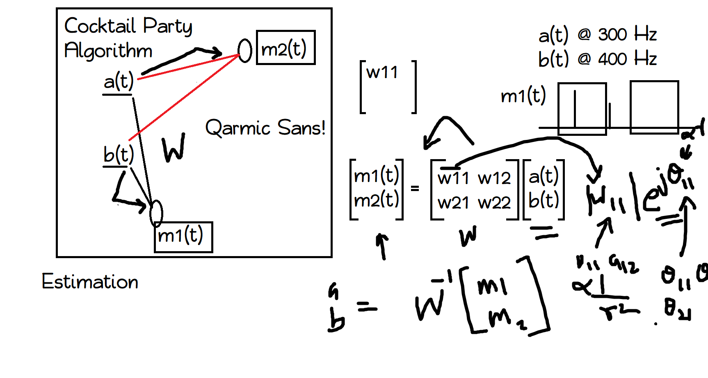

# CocktailParty

Trying out a solution to cocktail party problem
Assumption: There are only TWO signals. (ie 2x2 system)

The basic components:
Import/Export .wav files
Math block that estimates the two signals, based on correlation (may end up using SVD)

//added by akash permanent
